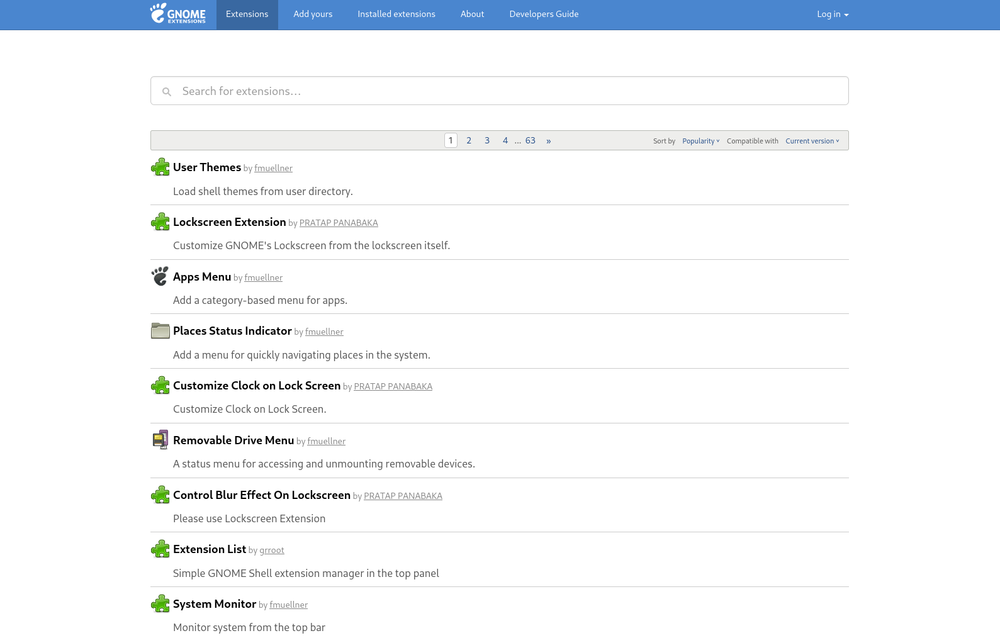
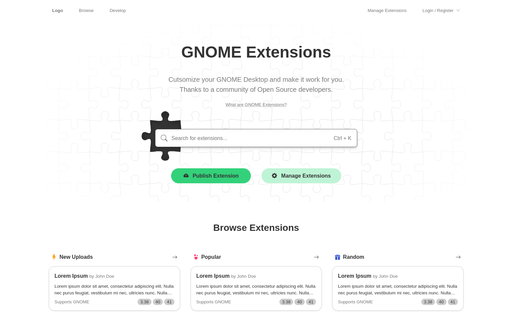
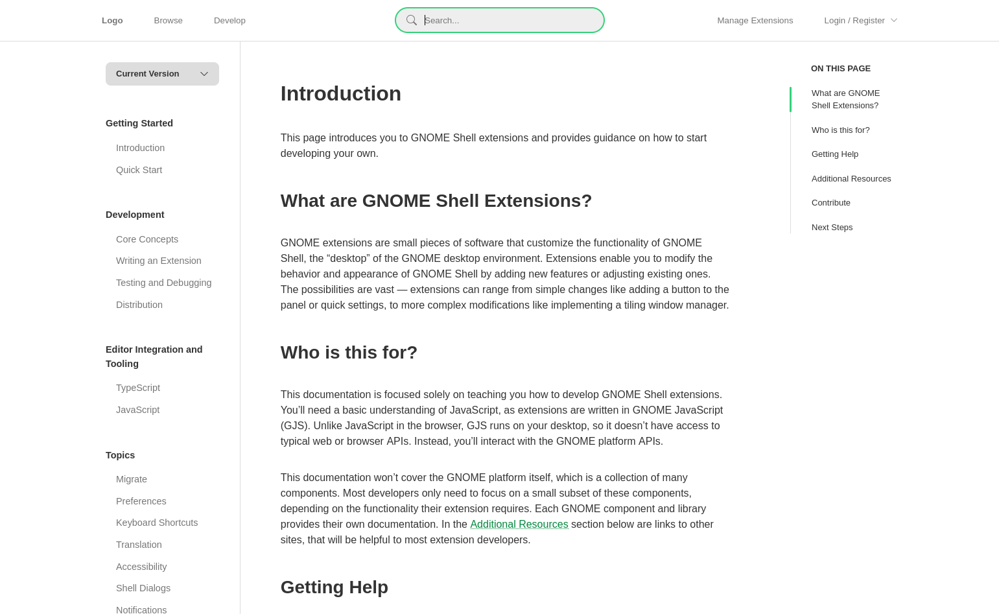
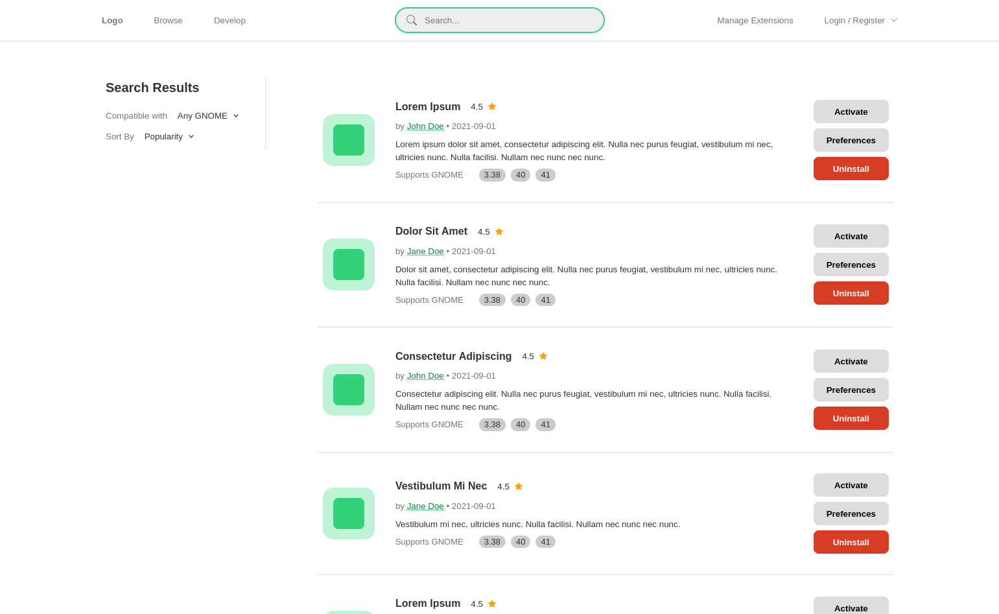

# Frontend concept for extensions.gnome.org

This repository hosts an (unofficial) frontend concept for [extensions.gnome.org](https://extensions.gnome.org/) (ego). As I wanted to do some web development and since I develop GNOME extensions, I thought this might me a suitable project because ego hasn't updated its look in forever:

This is only an alternative frontend. Additionally, it only uses fake data. I tried to create a proper frontend initially, however when I sent out HTTP requests, I noticed that ego is missing the `Access-Control-Allow-Origin` header, so browsers block the request. While there are ways around this like using a (public) proxy, I didn't think it was worth the effort, so I just ended up using placeholders. Towards the end, I got lazy and didn't create all possible pages. This also resulted in a decreasing quality 😅 and some issues (in Firefox). The following pages exist

- [Home](https://leleat.github.io/alt-ego/)

- [Extension](https://leleat.github.io/alt-ego/extension)

- [Developer Guide](https://leleat.github.io/alt-ego/develop)

- [Search](https://leleat.github.io/alt-ego/search)

